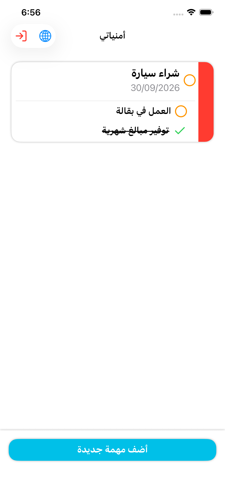
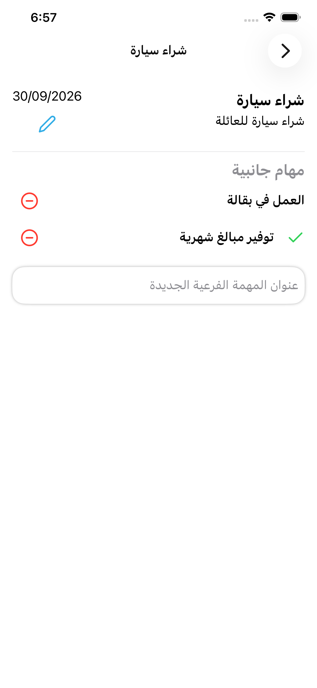
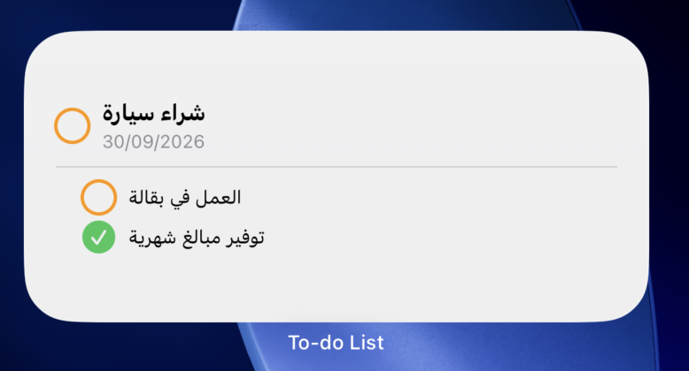

# ToDoListIos

A native iOS to‑do app built with SwiftUI and Firebase. Tasks support due dates, colors, sub‑tasks, and calendar sync, and your favorite task can be pinned to a Home Screen / Lock Screen widget that you can check off without opening the app.

<!--
  Add screenshots here once available, e.g.:
  <p align="center">
    
    
    
  </p>
  Send the images over and they can be dropped straight into this section.
-->

## Features

- **Auth** — email/password sign up, login, password reset, and account deletion, all backed by Firebase Authentication.
- **Tasks** — create tasks with a title, optional description, due date, color tag, and sub‑tasks; edit, complete, or delete them with swipe actions.
- **Sub‑tasks** — a task auto‑completes once every sub‑task is checked off.
- **Favorites** — mark one task as favorite to surface it on the Home Screen widget and Lock Screen.
- **Home Screen & Lock Screen widget** — shows the favorite task (and its sub‑tasks) in small/medium/large and accessory‑rectangular sizes; tapping a status circle toggles completion via a deep link, without launching the app.
- **Calendar sync** — optionally add a task's due date to the system calendar (via EventKit) when it's created or updated, and clean up the event when the task is deleted.
- **Localization** — full English and Arabic support with automatic right‑to‑left layout, toggleable in‑app.
- **Feedback & polish** — Lottie animations (splash screen, task‑completed celebration), a completion sound effect, toast messages, and a shared alert system.
- **Adaptive layout** — `NavigationSplitView` on regular‑width devices (iPad, unfolded/large iPhones) with task details in a persistent column, and a plain `NavigationStack` on compact widths.

## Tech stack

- **UI:** SwiftUI, Lottie (`lottie-ios`) for animations
- **Backend:** Firebase Authentication + Cloud Firestore
- **Native frameworks:** WidgetKit (Home Screen/Lock Screen widget), ActivityKit (Live Activity scaffold), EventKit (calendar sync), AVFoundation (sound effects)
- **Language:** Swift 5
- **Dependency management:** Swift Package Manager

## Project structure

```
ToDoListIos/
├── ToDoListIos/                # Main app target
│   ├── APIs/                   # Firebase Auth & Firestore calls
│   ├── Containers/             # Screens: Login, Register, ForgetPassword,
│   │                           #   AccountDeletion, Dashboard, CreateNewTask,
│   │                           #   TaskDetails
│   ├── Components/             # Reusable views (task rows, buttons, inputs, toolbar…)
│   ├── Managers/                # App-wide state: TaskStore, AppToken, AppColors,
│   │                           #   AppLanguageManager, Loading/Toast/Alert managers…
│   ├── Support/                # Calendar sync, widget sync, validators, helpers
│   ├── Resources/              # Lottie files, sound assets
│   └── en.lproj / ar.lproj     # Localized strings
├── ToDoAppWidget/               # WidgetKit extension (Home Screen, Lock Screen, Live Activity)
├── SharedModels/                # Local Swift package shared by the app and the widget
│                                #   (ToDoTask/MainTask/SubTask models, colors, widget deep links)
├── ToDoListIosTests/            # Unit tests
└── ToDoListIosUITests/          # UI tests
```

The app and the widget extension share task and color models through the local `SharedModels` Swift package, and share the favorite task and selected language through an App Group (`UserDefaults(suiteName:)`) so the widget stays in sync without a network call.

## Requirements

- Xcode 16 or later
- iOS 18.2+ for the main app target (the widget extension targets iOS 17+)
- A Firebase project with **Authentication** (Email/Password) and **Cloud Firestore** enabled

## Getting started

1. **Clone the repo**

   ```bash
   git clone https://github.com/AbdulkareemMashabi/ToDoListIos.git
   cd ToDoListIos
   ```

2. **Add your Firebase config**

   Create a Firebase project, add an iOS app with bundle ID `com.AbdulkareemMashabi.ToDoList`, download the generated `GoogleService-Info.plist`, and place it in `ToDoListIos/` (it's git‑ignored, so it won't be committed). Enable **Email/Password** sign‑in and create a **Cloud Firestore** database.

3. **Open the project**

   Open `ToDoListIos.xcodeproj` in Xcode. Swift Package Manager will resolve the Firebase, Lottie, and other dependencies automatically.

4. **Set your team & App Group**

   In the Signing & Capabilities tab for both the `ToDoListIos` and `ToDoAppWidget` targets, select your own development team and make sure both targets share the same App Group (used to pass the favorite task between the app and the widget).

5. **Run**

   Select the `ToDoListIos` scheme and run on a simulator or device. To try the widget, add it to the Home Screen or Lock Screen after running the app at least once and marking a task as a favorite.

## Localization

Strings live in `en.lproj` and `ar.lproj` (app target) and their equivalents in the widget target. The in‑app globe button toggles between English and Arabic at runtime; Arabic automatically switches the layout to right‑to‑left.

## Testing

- Unit tests: `ToDoListIosTests`
- UI tests: `ToDoListIosUITests`

Run them from Xcode with `Cmd+U`, or from the command line:

```bash
xcodebuild test -project ToDoListIos.xcodeproj -scheme ToDoListIos -destination 'platform=iOS Simulator,name=iPhone 16'
```

## Author

Built by [Abdulkareem Mashabi](https://github.com/AbdulkareemMashabi).
